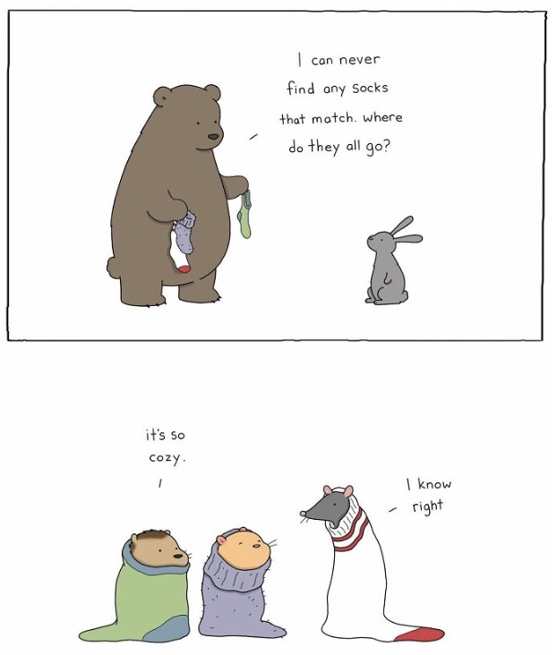

### [Animator Illustrates Humorous Everyday Moments of Talking Animals](https://web.shanbay.com/reading/web-news/articles/bbzaqn)

### 萌趣动物漫画，治愈你累积一周的疲惫

Liz Climo is an American cartoonist **known** **for** her adorable animal illustrations.

Liz Climo是一位美国漫画家，以其可爱的动物插图而闻名

In her comics,she often imagines the everyday problems and moments animals might face if they interacted the way we humans do.Her cartoons **focus** **on** positivity,self-love,and finding joy in life.The diverse nature of Climo's characters makes readers feel like they belong and are represented in her work.

在她的漫画中，她经常想象动物如果像我们人类一样互动时会面临的日常问题和时刻。她的卡通关注于积极性、自爱、和在生活中找到乐趣。Climo笔下人物的多样性使读者感觉他们像是属于她的，并且在她的作品中得到了体现。

We've collected some of the most recent comics Climo shared for you to enjoy.Scroll down to **immerse** yourself **in** the humorous universe of talking animals!

我们收集了Climo分享的一些最新漫画供您欣赏。请向下滚动，让您沉浸在会说话的动物的幽默世界中！

#### #1
It's important to acknowledge and celebrate your feelings.

承认并庆祝自己的感受很重要。

#### #2
-How's the water?

-水温怎么样？

-Cold.Really cold.

-凉，真的很凉。

#### #3
-Here's that moving box you asked for.Where are you moving, anyway?

-这是你要的移动箱子。总之，你要搬到哪里去?

-Into the box.

-放进到盒子里。

#### #4
-Wanna see something cute?

-想看看可爱的东西吗？

-Okay.

-好的。

#### #5
-I made cookies to bring to the party tonight.

-我做了饼干带到今晚的聚会上。

-Wow.Those smell so good.

-哇，闻起来真香

-Hello!We brought you a plate.

-你好！我们给你带来了一个盘子。

#### #6
-Does this hat make my ears look big?

-这顶帽子让我的耳朵看起来大吗？

-Uh...**sort of**?

-呃…有点？

-Cool,I love my big ears.

那太酷了。我爱我的大耳朵。

#### #7
-Huh?
-嗯？

-"By the time you read this, I'll be on my way to give you a little hug."

-"当你读到这段话的时候，我已经在路上了，准备来给你一个小小的拥抱。"

#### #8
-Want me to make you a balloon animal?

-想让我给你做一个气球动物吗？

-Okay.OMG.It looks just like me!

-好呀。天哪，看起来就像我一样！

#### #9
-I'm sorry I don't have any magic words that will make you **feel better**.But I did bring you a cookie.

-很抱歉我不会说神奇的词语来讨你开心，但我给你带来了一块曲奇饼。

-There they are.Those are the magic words.

-它们在那里。这些就是神奇的词语。

#### #10
-I can never find any socks that match.Where do they all go?

-我再也找不到匹配的袜子了。它们都去哪里了？

-It's so cozy.

-太舒服了。

-I know right.

我知道是这样的。

