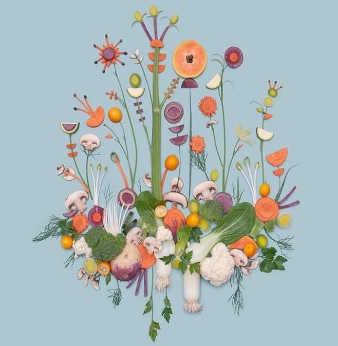
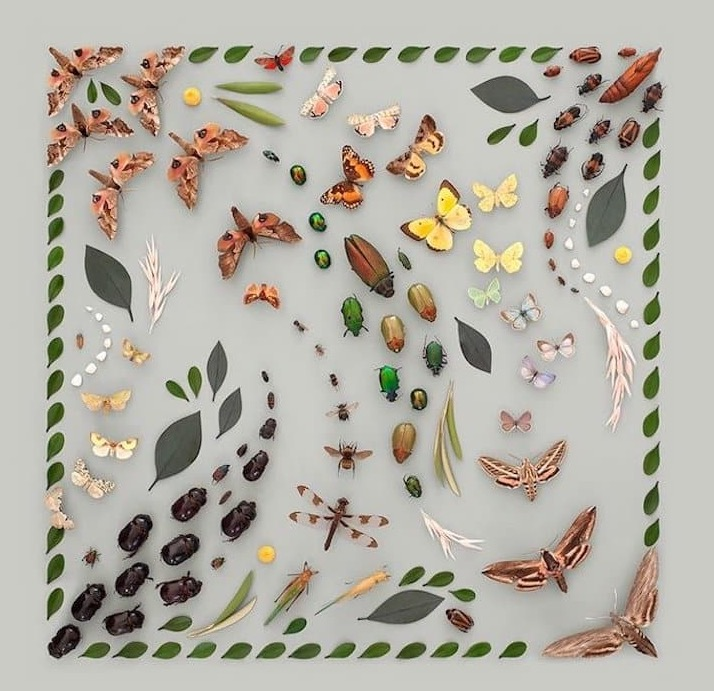
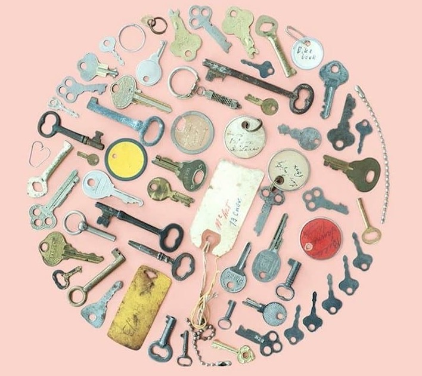
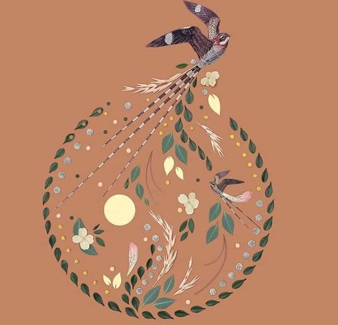

### [The Way This Artist Organizes Objects Is Incredibly Satisfying](https://web.shanbay.com/reading/web-news/articles/bvnqtu)
### 极度舒适：树叶、水果被排列成视觉作品

Leaves, fruits, and even butterflies **come together** to form unexpectedly beautiful arrangements in Kristen Meyer's art.The Connecticut-based prop stylist and designer **specializes in** geometric flat lays containing **dozens of** different objects.They are **laid out** in evenly spaced patterns until they form stunning designs that look computer-made.

在Kristen Meyer的艺术中，树叶、水果甚至蝴蝶聚集在一起，形成了出乎意料的美丽排列。这位康涅狄格州的道具造型师和设计师专门设计包含数十种不同物体的几何平面。它们以均匀的间隔排列，直到形成令人惊叹的设计，看起来像是电脑制造的。

The choice of materials in Meyer's flat lays varies **as much as** the final shape.Her work includes everything from pencils and sticky notes to scraps of trash.However, the way she makes them appealing is always the same.

Meyer平面设计中所用的材料选择如同最终（摆好）的形状一样，种类繁多。她的作品包罗万象，从铅笔、便签到垃圾碎片。然而，这些作品吸引人的方式却是一样的。

After collecting the chosen materials, she modifies them as necessary so she can fit them into planned patterns.This might require cutting items with scissors or knives as well as carefully tearing the edges.

在收集完选定的材料后，她会根据需要对其进行修改，以便将其放入计划的图案中。这可能需要用剪刀或刀切割物品，并小心撕开边缘。

Regardless of the method, Meyer **makes sure** that the alterations fit seamlessly with the design she has in mind.For instance, cuts of watermelon are carved into circles and half-circles and placed accordingly on a pastel-colored background.

无论采用何种方法，Meyer都会确保这些改动与她心目中的设计完美契合。例如，西瓜的切片被雕刻成圆形和半圆，并相应地放置在柔和的背景上。

Many of Meyer's most recognizable flat lays have a clear geometric shape like squares and circles.Some of her newer pieces, however, possess a more expressive form.In one piece, for example, she uses cut flower stems to create intricate pathways **similar to** circuits or veins.The flora are aligned from the flower to the end of the stem, creating visual routes across the arrangement.Leaves are carefully added to enhance the effect.

Meyer的许多最知名的平面布局都有清晰的几何形状，如正方形和圆形。然而，她的一些新作品具有更具表现力的形式。例如，在一件作品中，她使用切割的花茎来创造类似于回路或静脉的复杂路径。植物群从花朵到茎的末端排列整齐，形成了贯穿整个排列的视觉路线。叶子被精心添加以增强效果。

上面的图片来自互联网。如果有任何侵犯版权的行为，请立即通知我们，我们将予以删除。
