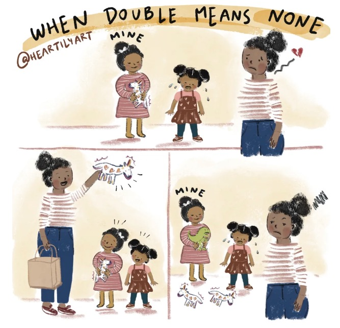
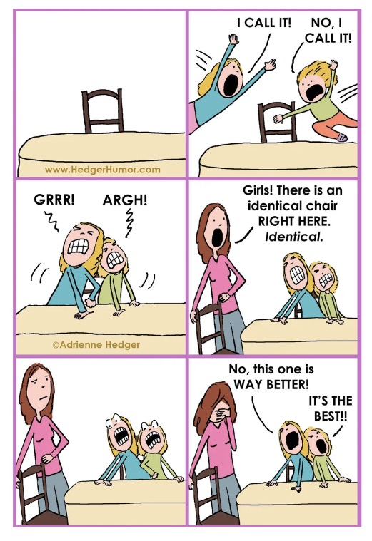

### [These Relatable Comics Sum Up Sibling Relationships Perfectly](https://web.shanbay.com/reading/web-news/articles/izxmz)
### 漫画揭示：有兄弟姐妹是种怎样的体验？

Cartoonist Adrienne Hedger illustrates **all kinds of** different relationship dynamics, but one of her favorites is the bond between siblings.

漫画家Adrienne Hedger展示了各种不同的关系动态，但她最喜欢的是兄弟姐妹之间的纽带。

"Sibling relationships encompass so many human experiences - love, competition, exasperation, tenderness, annoyance, support, fun, and the intense desire to yell, "I'M TELLING ON YOU!'"Hedger said."Cartoons are a perfect way to capture all that absurdity."

“兄弟姐妹关系包含了很多人类的经历——爱、竞争、愤怒、温柔、烦恼、支持、乐趣，以及大喊“我要告发你！”Hedger说：“漫画能完美捕获那些荒唐的事情。“

**Over the years**, she's turned many of her own experiences from having siblings - and raising them - into hilarious cartoons.

多年来，她把自己从有兄弟姐妹到抚养他们的许多经历变成了搞笑的漫画。

"Your siblings know your embarrassing stories, they remember your terrible haircuts, and they are the only people who truly know what it's like to be in your family," Hedger said."You love each other, you bug each other, and you'll always be there for each other."

Hedger说：“你的兄弟姐妹知道你的尴尬故事，他们记得你糟糕的发型，他们是唯一真正知道在你的家庭里是什么感觉的人。”。“你们彼此相爱，彼此纠缠，但你们将永远在彼此身边。”

"As these cartoons show, there are sweet and loving moments between siblings, and a lot of ridiculous moments too," she noted.

她指出：“正如这些漫画所示，兄弟姐妹之间有甜蜜和爱的时刻，也有很多荒谬的时刻。”。

"When you're parenting siblings, you see that the kids hate each other one minute, and love each other the next.They will **team up** against you.The older one will teach the younger one unfortunate things.They'll **engage in** the most absurd fights you've ever witnessed.It's all quite funny, and cartoons let us **step back** and appreciate the humor."

“当你养育兄弟姐妹时，你会看到孩子们前一分钟互相生气，下一分钟又互相和好。他们将会配合对付你。大孩子会教小孩子一些不好的事情。他们将参与到愚蠢的战斗而你作为见证人。这一切都很有趣，动画片让我们退后一步，欣赏其中的幽默。”

"Whether you are a sibling, you're parenting siblings, or both, just know that you're not crazy," she said."These relationships can be really complicated, while **at the same time** being really rewarding."

“无论你拥有兄弟姐妹，还是你正养育些兄弟姐妹，或者两者皆有，只需要知道你不是疯狂的”她说，“这些关系真的很复杂，然而同时，又很有意义”

"Let's be thankful for all the interesting and unique experiences siblings add to our lives," Hedger said."When you think about it, they're the only people who can put you in a headlock, then steal your clothes, and somehow you still love them."

“让我们感谢兄弟姐妹为我们的生活增添的所有有趣和独特的经历”Hedger说。“仔细想想，他们是唯一能掐住你的脖子，然后偷走你衣服的人，不知何故，你仍然爱他们。”

Images above from the internet.If there is any copyright infringement, please notify us at once and we'll delete it.

以上图片来自网络。如有侵权，请立即通知我们，我们将予以删除。
