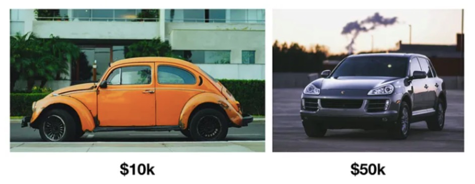
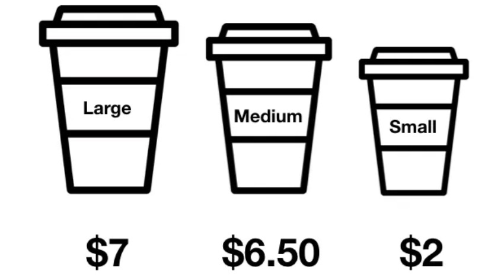

### [The Decoy Effect:How to Mold Customer Choice Through Pricing](https://web.shanbay.com/reading/web-news/articles/btrnfu)
### 诱饵效应：购物，你真的捡到便宜了吗？

The Decoy Effect describes how price comparisons between products affect choice.It states that when there are only two options,and they're priced "fairly," people make decisions according to personal preference.

诱饵效应描述了产品的价格比较如何影响选择。这表明仅有两个选择时，且价格“公平”，人们根据个人喜好做决定。

But,if there's a third choice that's overpriced compared to the first two options,it changes how people consider all of the options.The third option is a "decoy" choice.

但是如果有第三个选项，比前两个选项价格过高，它会改变人们对所有选择的看法。第三个选项就是诱饵效应。

The decoy's purpose is to change perceptions of the other options,not sell.

这个诱饵的目的就是改变人们对其他选择的认知看法，而非售卖。

Why?Customers compare the other products against the decoy.And because the decoy price is unreasonably high,everything else seems reasonable **in comparison**.

为什么呢?顾客将其他产品与诱饵作比较。因为诱饵价格相当高，那么其他产品相比较下就更为合理。

The Decoy Effect works because people are clueless about what something **is supposed to** cost.William Poundstone,author of "Priceless:The Myth of Fair Value,"put it this way:

诱饵效应之所以起作用是因为人们对所购买事物的价格一无所知。William Poundstone《公允价值的神话》的作者是这样说的。

"People tend to be clueless about prices,Contrary to economic theory,we do not really decide between A and B by consulting our invisible **price tags** and purchasing the one that yields the higher utility.We **make do** with guesstimates…"

“人们往往对价格一无所知。与经济理论相反，我们并不是通过查阅我们无形的价格标签并购买效用更高的价格标签来真正在A和B之间做出决定。我们只能靠猜测……”

#### Examoles of the Decoy Effect in Action
#### 诱饵效应的示例

Below you can see two examples of choice sets - one without a decoy,and one with a decoy.

下面你可以看到两个选择的例子——一个没有诱饵，另一个有诱饵。

Choice set with no decoy:

没有诱饵的选择套餐：

This choice set is **far apart** both in features and in price.A customer **looking at** these options would be swayed more by their own needs than by the car's price.

这套选择无论是在价格上还是功能上都相去甚远。考虑这些选择的顾客更多会受到他们需求的影响，而非车价格的影响。

Choice set with a decoy:

选择诱饵的套餐

In the example above,the price of the medium coffee($6.50)**acts as** the decoy to push more people toward a large.The price difference between the small and the medium is much more than the price difference between the medium and the large.

在上面的例子中，中等咖啡的价格（6.50美元）充当了诱饵，将更多的人推向大咖啡。小咖啡和中等咖啡之间的价格差异远大于中等咖啡和大咖啡之间的价差。

The greater the difference between the decoy and the low-priced option,the greater the effect.

诱饵和低价选项的差异越大，这个诱饵效应作用越大。