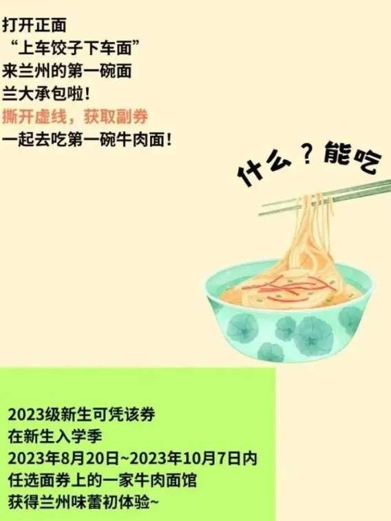
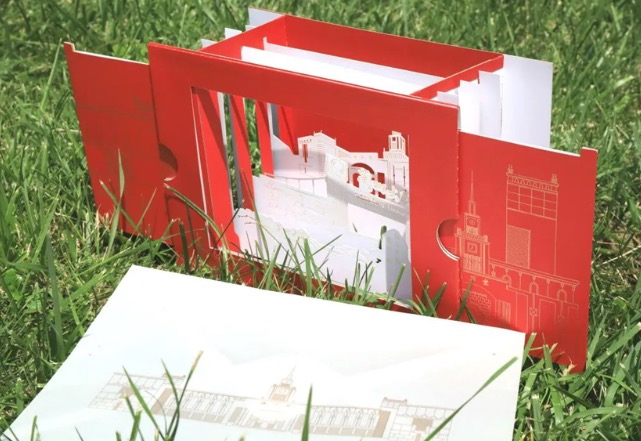
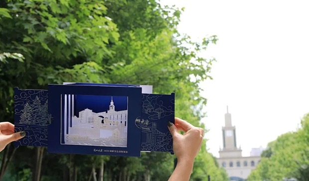

### [The Admission Letter From Lanzhou University Has Gone Viral](https://web.shanbay.com/reading/web-news/articles/blavas)
### 真见“面”礼！新生第一碗牛肉面，学校请了

The admission letter from Lanzhou University has attracted a lot of attention and envy among netizens due to its unique and enticing offer - an "edible" gift!

兰州大学的录取通知书以其独特诱人的“可食用”礼物吸引了众多网友的关注和羡慕！

When opening the admission letter, recipients will find a coupon for a bowl of beef noodles.It turns out that Lanzhou University wants to treat every new student to their first serving of beef noodles upon their arrival in Lanzhou.

当打开录取通知书时，收件人会发现一碗牛肉面的优惠券。原来，兰州大学希望每位新生在抵达兰州后都能吃到他们的第一份牛肉面。

For the incoming freshman class of 2023, this coupon can be redeemed at any of the featured noodle restaurants between Aug 20 and Oct 7, 2023, allowing them to enjoy a delicious bowl of Lanzhou beef noodles.

对于即将入学的2023级新生，此优惠券可在2023年8月20日至10月7日期间在任何一家特色面馆兑换，让他们享受一碗美味的兰州牛肉面。

Lanzhou beef noodles, a Chinese style hand-pulled noodle which originated in Lanzhou, has a 100-year history.

兰州牛肉面是一种起源于兰州的中式手工拉面，已有百年历史。

A typical Lanzhou beef noodles is described to be "1 clear, 2 white, 3 red, 4 green, 5 yellow" to signify respectively clear soup, white radish, red chili oil, green coriander and garlic leek and yellow noodles.

一个典型的兰州牛肉面被描述为“1清2白3红4绿5黄”，分别表示清汤、白萝卜、红辣椒油、绿香菜、大蒜韭菜和黄面条。

In terms of design, the admission letter adopted a creative three-dimensional format.It consists of three distinct layers: the first layer showcases the school emblem and the motto stone, the second layer depicts the iconic main gate of Lanzhou University, and the third layer features the visually striking Jishi Hall.

在设计上，录取通知书采用了富有创意的三维格式。它由三层组成：第一层展示了校徽和校训石，第二层描绘了兰州大学标志性的正门，第三层展示了视觉上引人注目的积石堂。

The design of the undergraduate admission letter highlights a vibrant red background, while the graduate admission letter incorporates the distinctive "Lanzhou University Blue" as its main color tone.

本科录取通知书的设计突出了鲜艳的红色背景，而研究生录取通知书则以独特的“兰州大学蓝”为主色调。

